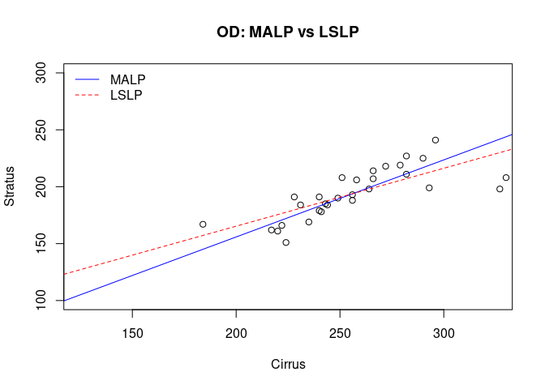

[](https://github.com/pchausse/malp/actions)

Maximum Agreement Linear Predictor
==================================

The `malp` package implements the maximum linear prediction (MALP)
developped by Kim et al. (2023). The MALP is defined as the linear
predictor that maximizes the concordance correlation coefficient.
Suppose we have a $p\times 1$ vector of covariates $x$ and a dependent variable
$Y$. The MALP predictor is:

$$
\tilde{Y}^\star(x) = \left(1-1/\gamma\right)\mu_\mathrm{Y}+ \left( 1/\gamma\right) \tilde{Y}^\dagger(x)\,,
$$

where $\gamma$ is the concordance correlation coefficient (CCC),
$\mu_\mathrm{Y}$ is the population mean of Y and                                                                                                                                              
$\tilde{Y}^\dagger(x)$ is the best linear predictor. For any predictor $\tilde{Y}$, the CCC is defined as 

$$ 
\gamma = \frac{2\sigma\_{\mathrm{Y}\tilde{\mathrm{Y}}}}{
\sigma^2\_\mathrm{Y}+\sigma^2\_{\tilde{\mathrm{Y}}}+(\mu\_\mathrm{Y}-\mu\_{\tilde{\mathrm{Y}}})}\\,.
$$

Let $X=\\{1,x'\\}'$ and let the best linear predictor
$\tilde{Y}^\dagger(x)$ be $X'\beta\equiv \beta_1+x'\beta_2$, where
$\beta_1=\mu_\mathrm{Y}-\mu_\mathrm{x}'\beta_2$ and
$\beta_2=Var(X)^{-1}Cov(X,Y)$, then the MALP can be written as:

$$
\begin{split}
\tilde{Y}^\star(x)  = & 
  \left(1-1/\gamma\right)\mu\_\mathrm{Y}+ \left( 1/\gamma\right) \left\[X'\beta\right\]\\
= & \left\[(1-1/\gamma)\mu\_\mathrm{Y}+\beta\_1/\gamma\right\] + 
x'\[\beta\_2/\gamma\] \\
\equiv &  \alpha\_1 + x'\alpha\_2\\
\equiv &  X'\alpha
\end{split}
$$

Assuming we have an IID sample $\{Y_i,x_i\}$ of size $n$, a consistent estimator of the MALP at $x=x_0$ is:

$$
\hat{Y}^\star(x_0) = \hat{\alpha}_1 + x_0'\hat{\alpha}_2\,,
$$

where $\hat{\alpha}_1=(1-1/\hat\gamma)\overline{\mathrm{Y}}+\hat\beta_1/\hat\gamma$, $\hat{\alpha}_2 = \hat{\beta}_2/\hat\gamma$, $\hat\beta_1$ and
$\hat{\beta}_2$ are the least square estimators, $\overline{\mathrm{Y}}$ is the sample mean of Y and $\hat\gamma$ is the square root of the least square coefficient of determination.

Example: Eye Data Set
---------------------

In opthalmology, the central subfield macular thickness (CSMT)
measurements can be obtained by optical coherence tomography (OCT).
Abedi et al. (2011) focused on two types of OCT: time-domain Stratus
OCT, the most widely used model prior to 2006; and spectral-domain
Cirrus OCT, a more advanced model. As Cirrus OCT replaces Stratus OCT as
a marker, the agreement between the measurements from two methods is of
interest to researchers in the field. For this purpose, Abedi et al.
(2011) provided a comparison between the two approaches and obtained a
CCC-based conversion function from the Cirrus OCT to the Stratus OCT.

In the data set, both OCTs were measured from 46 subjects, i.e., 92
eyes, but only 61% of these observations were selected based on the
reliability of the OCTs (signal strength ≥ 6 for both approaches). This
subset of the original dataset is included in the package. To avoid the
problem of correlation between observations, we only illustrate the
method using right eye observations.

``` r
library(malp)
data(eye)
eye <- subset(eye, Eye=="OD")
```

We first compare the least squares the malp estimates:

``` r
fit <- lm(Stratus~Cirrus, eye)
mfit <- malp(Stratus~Cirrus, eye)
knitr::kable(summary(fit)$coef, caption="Least Squares")
```

|             |    Estimate|  Std. Error|   t value|  Pr(\>\|t\|)|
|:------------|-----------:|-----------:|---------:|------------:|
| (Intercept) |  63.5089313|  21.7767222|  2.916368|    0.0069012|
| Cirrus      |   0.5090726|   0.0843545|  6.034919|    0.0000017|

``` r
knitr::kable(summary(mfit)$coef, caption="MALP")
```

|             |   Estimate|  Std. Error|    t value|  Pr(\>\|t\|)|
|:------------|----------:|-----------:|----------:|------------:|
| (Intercept) |  20.473627|   27.545111|  0.7432763|    0.4573144|
| Cirrus      |   0.677048|    0.112611|  6.0122742|    0.0000000|

The CCC for the LSLP is equal to 0.7223338, and it is equal to 0.7519003
for MALP. As expected, the CCC is higher for MALP since it maximizes it.
We can compare the two fitted lines:

``` r
plot(Stratus~Cirrus, eye, xlab="Cirrus", ylab="Stratus",
     main="OD: MALP vs LSLP", xlim=c(125,325), ylim=c(100,300))
abline(mfit, lty=1, col="blue")
abline(mfit$lm, lty=2, col="red")
abline(1,1,lty=3)
```



References
==========

Abedi, Gelareh, Payal Patal, Gheorghe Doros, and Manju L Subramanian.
2011. “Transitioning from Stratus OCT to Cirrus OCT: A Comparison and a
Proposed Equation to Convert Central Subfield Macular Thickness
Measurements in Healthy Subjects.” *Graefe’s Archive for Clinical and
Experimental Ophthalmology* 249 (9): 1353–7.

Kim, Taeho, George Luta, Matteo Bottai, Pierre Chausse, Gheorghe Doros,
and Edsel A. Pena. 2023. “Maximum Agreement Linear Prediction via the
Concordance Correlation Coefficient.” <http://arxiv.org/abs/2304.04221>.
